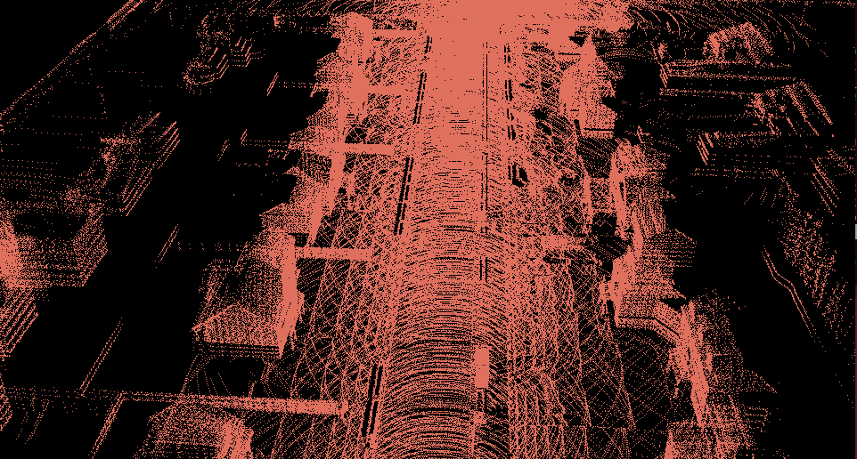
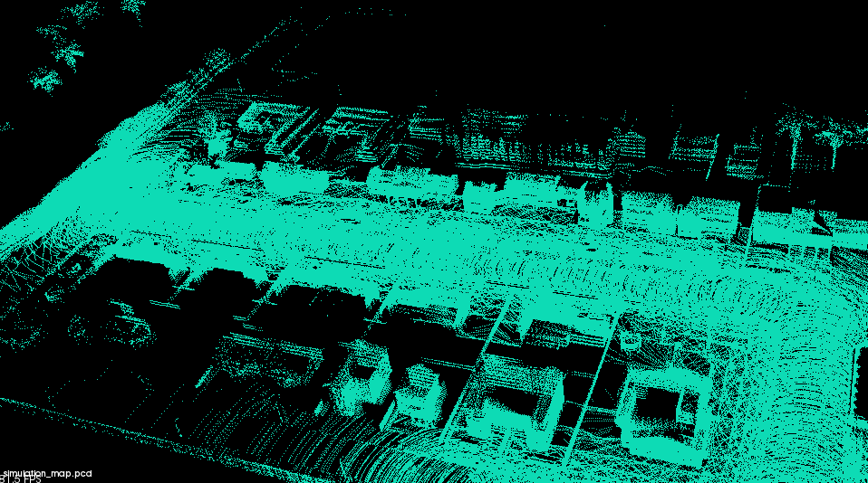

# Autoware Lidar SLAM lidar_localizer 分析

### ndt_mapping 

Autoware 中利用激光雷达做SLAM构建3-D map的思路比较直接，基于NDT配准计算变换矩阵，然后就构建出地图。

我们知道NDT可以做两帧点云数据之间的匹配，NDT计算得到的结果就是一个变换矩阵，也就是描述了如何将输入点云转换成目标点云。关于NDT配准的，会在NDT方法中详谈。

在NDT变换中，如何给出一个可靠的初始变换矩阵是比较重要的。可靠的初始值能快速收敛并得到最优变换值。

在ndt_mapping中，提供了几种计算初始变换矩阵的方法。

1. IMU。 我们知道可以利用IMU感知车辆的角速度和加速度，利用这些值可以积分得到车辆的位置信息。
2. 里程计。ndt中提供了一种基于里程计的方式计算车辆的实时位置。
3. IMU,里程计的融合处理。
4. 直接初值法。直接利用前一帧计算的转换矩阵做为当前帧的初始变换矩阵。

在ndt_mapping文件中，具体在computing/perception/localization/lidar_localizer/nodes/ndt_mapping/ndt_mapping.cpp中

### 初始化

imu基本配置，ndt计算方法，地图更新方法等信息。

```c++
private_nh.getParam("method_type", method_type_tmp);
_method_type = static_cast<MethodType>(method_type_tmp);
private_nh.getParam("imu_upside_down", _imu_upside_down);
private_nh.getParam("imu_topic", _imu_topic);
private_nh.getParam("incremental_voxel_update", _incremental_voxel_update);
```

监听哪些消息，其中points_raw就是lidar点云数据，/vehicle/odom是里程计信息，_imu_topic是imu信息。

config/ndt_mapping 是ndt算法的一些配置信息，ndt_mapping_output 是获取整个点云地图的消息。

```c++
// main 函数中
  ros::Subscriber param_sub = nh.subscribe("config/ndt_mapping", 10, param_callback);
  ros::Subscriber output_sub = nh.subscribe("config/ndt_mapping_output", 10, output_callback);
  ros::Subscriber points_sub = nh.subscribe("points_raw", 100000, points_callback);
  ros::Subscriber odom_sub = nh.subscribe("/vehicle/odom", 100000, odom_callback);
  ros::Subscriber imu_sub = nh.subscribe(_imu_topic, 100000, imu_callback);
```

### 初始变换矩阵估计

**imu**

```c++
static void imu_callback(const sensor_msgs::Imu::Ptr& input)
{
  // std::cout << __func__ << std::endl;

  if (_imu_upside_down)
    imuUpsideDown(input);

  const ros::Time current_time = input->header.stamp;
  static ros::Time previous_time = current_time;
  const double diff_time = (current_time - previous_time).toSec();

  double imu_roll, imu_pitch, imu_yaw;
  tf::Quaternion imu_orientation;
  tf::quaternionMsgToTF(input->orientation, imu_orientation);
  // 根据IMU信息，直接获取RPY角，
  tf::Matrix3x3(imu_orientation).getRPY(imu_roll, imu_pitch, imu_yaw); 
  // 转换到[-pi, pi]
  imu_roll = wrapToPmPi(imu_roll);
  imu_pitch = wrapToPmPi(imu_pitch);
  imu_yaw = wrapToPmPi(imu_yaw);

  static double previous_imu_roll = imu_roll, previous_imu_pitch = imu_pitch, previous_imu_yaw = imu_yaw;
  // 计算相邻两帧IMU之间的差值做为角速度，后续用插值法计算初值。
  const double diff_imu_roll = calcDiffForRadian(imu_roll, previous_imu_roll);
  const double diff_imu_pitch = calcDiffForRadian(imu_pitch, previous_imu_pitch);
  const double diff_imu_yaw = calcDiffForRadian(imu_yaw, previous_imu_yaw);

  imu.header = input->header;
  // 坐标表示，x向前，y向左，z向天
  imu.linear_acceleration.x = input->linear_acceleration.x;
  // imu.linear_acceleration.y = input->linear_acceleration.y;
  // imu.linear_acceleration.z = input->linear_acceleration.z;
  imu.linear_acceleration.y = 0;
  imu.linear_acceleration.z = 0;

  if (diff_time != 0)
  {
    imu.angular_velocity.x = diff_imu_roll / diff_time;
    imu.angular_velocity.y = diff_imu_pitch / diff_time;
    imu.angular_velocity.z = diff_imu_yaw / diff_time;
  }
  else
  {
    imu.angular_velocity.x = 0;
    imu.angular_velocity.y = 0;
    imu.angular_velocity.z = 0;
  }
  // 估计当前的变换矩阵
  imu_calc(input->header.stamp);

  previous_time = current_time;
  previous_imu_roll = imu_roll;
  previous_imu_pitch = imu_pitch;
  previous_imu_yaw = imu_yaw;
}
/**
插值计算当前的角度。
*/
static void imu_calc(ros::Time current_time)
{
  static ros::Time previous_time = current_time;
  double diff_time = (current_time - previous_time).toSec();

  double diff_imu_roll = imu.angular_velocity.x * diff_time;
  double diff_imu_pitch = imu.angular_velocity.y * diff_time;
  double diff_imu_yaw = imu.angular_velocity.z * diff_time;

  current_pose_imu.roll += diff_imu_roll;
  current_pose_imu.pitch += diff_imu_pitch;
  current_pose_imu.yaw += diff_imu_yaw;
  // 注意，使用Imu的时候，需要做角速度和加速度坐标系的对齐，按照RPY的顺序做旋转。
  double accX1 = imu.linear_acceleration.x;
  double accY1 = std::cos(current_pose_imu.roll) * imu.linear_acceleration.y -
                 std::sin(current_pose_imu.roll) * imu.linear_acceleration.z;
  double accZ1 = std::sin(current_pose_imu.roll) * imu.linear_acceleration.y +
                 std::cos(current_pose_imu.roll) * imu.linear_acceleration.z;

  double accX2 = std::sin(current_pose_imu.pitch) * accZ1 + std::cos(current_pose_imu.pitch) * accX1;
  double accY2 = accY1;
  double accZ2 = std::cos(current_pose_imu.pitch) * accZ1 - std::sin(current_pose_imu.pitch) * accX1;

  double accX = std::cos(current_pose_imu.yaw) * accX2 - std::sin(current_pose_imu.yaw) * accY2;
  double accY = std::sin(current_pose_imu.yaw) * accX2 + std::cos(current_pose_imu.yaw) * accY2;
  double accZ = accZ2;
  // 根据加速度估计位置。
  offset_imu_x += current_velocity_imu_x * diff_time + accX * diff_time * diff_time / 2.0;
  offset_imu_y += current_velocity_imu_y * diff_time + accY * diff_time * diff_time / 2.0;
  offset_imu_z += current_velocity_imu_z * diff_time + accZ * diff_time * diff_time / 2.0;

  current_velocity_imu_x += accX * diff_time;
  current_velocity_imu_y += accY * diff_time;
  current_velocity_imu_z += accZ * diff_time;
  // 角度的增量,这里是按照上一帧雷达数据到现在的累计。
  offset_imu_roll += diff_imu_roll;
  offset_imu_pitch += diff_imu_pitch;
  offset_imu_yaw += diff_imu_yaw;
  // 估计得到的加速度位置
  guess_pose_imu.x = previous_pose.x + offset_imu_x;
  guess_pose_imu.y = previous_pose.y + offset_imu_y;
  guess_pose_imu.z = previous_pose.z + offset_imu_z;
  // 估计当前帧lidar点云，注意两个变量的不同，
  guess_pose_imu.roll = previous_pose.roll + offset_imu_roll;
  guess_pose_imu.pitch = previous_pose.pitch + offset_imu_pitch;
  guess_pose_imu.yaw = previous_pose.yaw + offset_imu_yaw;

  previous_time = current_time;
}
```

**odom**

```c++
static void odom_callback(const nav_msgs::Odometry::ConstPtr& input)
{
  // std::cout << __func__ << std::endl;

  odom = *input;
  odom_calc(input->header.stamp);
}

static void odom_calc(ros::Time current_time)
{
  static ros::Time previous_time = current_time;
  double diff_time = (current_time - previous_time).toSec();
  // 根据角速度计算增量
  double diff_odom_roll = odom.twist.twist.angular.x * diff_time;
  double diff_odom_pitch = odom.twist.twist.angular.y * diff_time;
  double diff_odom_yaw = odom.twist.twist.angular.z * diff_time;
  // 估算当前帧角度
  current_pose_odom.roll += diff_odom_roll;
  current_pose_odom.pitch += diff_odom_pitch;
  current_pose_odom.yaw += diff_odom_yaw;
  //计算三个方向的位移
  double diff_distance = odom.twist.twist.linear.x * diff_time;
  offset_odom_x += diff_distance * cos(-current_pose_odom.pitch) * cos(current_pose_odom.yaw);
  offset_odom_y += diff_distance * cos(-current_pose_odom.pitch) * sin(current_pose_odom.yaw);
  offset_odom_z += diff_distance * sin(-current_pose_odom.pitch);
  
  offset_odom_roll += diff_odom_roll;
  offset_odom_pitch += diff_odom_pitch;
  offset_odom_yaw += diff_odom_yaw;
  // 估计当前帧的值。
  guess_pose_odom.x = previous_pose.x + offset_odom_x;
  guess_pose_odom.y = previous_pose.y + offset_odom_y;
  guess_pose_odom.z = previous_pose.z + offset_odom_z;
  guess_pose_odom.roll = previous_pose.roll + offset_odom_roll;
  guess_pose_odom.pitch = previous_pose.pitch + offset_odom_pitch;
  guess_pose_odom.yaw = previous_pose.yaw + offset_odom_yaw;

  previous_time = current_time;
}
```

**imu-odom**

```c++

static void imu_odom_calc(ros::Time current_time)
{
  static ros::Time previous_time = current_time;
  double diff_time = (current_time - previous_time).toSec();
   // 角速度使用imu
  double diff_imu_roll = imu.angular_velocity.x * diff_time;
  double diff_imu_pitch = imu.angular_velocity.y * diff_time;
  double diff_imu_yaw = imu.angular_velocity.z * diff_time;

  current_pose_imu_odom.roll += diff_imu_roll;
  current_pose_imu_odom.pitch += diff_imu_pitch;
  current_pose_imu_odom.yaw += diff_imu_yaw;
  // 距离使用 odom
  double diff_distance = odom.twist.twist.linear.x * diff_time;
  offset_imu_odom_x += diff_distance * cos(-current_pose_imu_odom.pitch) * cos(current_pose_imu_odom.yaw);
  offset_imu_odom_y += diff_distance * cos(-current_pose_imu_odom.pitch) * sin(current_pose_imu_odom.yaw);
  offset_imu_odom_z += diff_distance * sin(-current_pose_imu_odom.pitch);

  offset_imu_odom_roll += diff_imu_roll;
  offset_imu_odom_pitch += diff_imu_pitch;
  offset_imu_odom_yaw += diff_imu_yaw;

  guess_pose_imu_odom.x = previous_pose.x + offset_imu_odom_x;
  guess_pose_imu_odom.y = previous_pose.y + offset_imu_odom_y;
  guess_pose_imu_odom.z = previous_pose.z + offset_imu_odom_z;
  guess_pose_imu_odom.roll = previous_pose.roll + offset_imu_odom_roll;
  guess_pose_imu_odom.pitch = previous_pose.pitch + offset_imu_odom_pitch;
  guess_pose_imu_odom.yaw = previous_pose.yaw + offset_imu_odom_yaw;

  previous_time = current_time;
}
```


### 点云匹配及建图


```c++
static void points_callback(const sensor_msgs::PointCloud2::ConstPtr& input)
{
  double r;
  pcl::PointXYZI p;
  pcl::PointCloud<pcl::PointXYZI> tmp, scan;
  pcl::PointCloud<pcl::PointXYZI>::Ptr filtered_scan_ptr(new pcl::PointCloud<pcl::PointXYZI>());
  pcl::PointCloud<pcl::PointXYZI>::Ptr transformed_scan_ptr(new pcl::PointCloud<pcl::PointXYZI>());
  tf::Quaternion q;

  Eigen::Matrix4f t_localizer(Eigen::Matrix4f::Identity());
  Eigen::Matrix4f t_base_link(Eigen::Matrix4f::Identity());
  tf::TransformBroadcaster br;
  tf::Transform transform;

  current_scan_time = input->header.stamp;

  pcl::fromROSMsg(*input, tmp);
  // 滤除点云中的噪点
  for (pcl::PointCloud<pcl::PointXYZI>::const_iterator item = tmp.begin(); item != tmp.end(); item++)
  {
    p.x = (double)item->x;
    p.y = (double)item->y;
    p.z = (double)item->z;
    p.intensity = (double)item->intensity;
    // 根据水平距离过滤噪点
    r = sqrt(pow(p.x, 2.0) + pow(p.y, 2.0));
    if (min_scan_range < r && r < max_scan_range)
    {
      scan.push_back(p);
    }
  }

  pcl::PointCloud<pcl::PointXYZI>::Ptr scan_ptr(new pcl::PointCloud<pcl::PointXYZI>(scan));
  // 是否是第一帧
  // Add initial point cloud to velodyne_map
  if (initial_scan_loaded == 0)
  {
    // 根据输入参数，直接将点云变换保存到地图中
    pcl::transformPointCloud(*scan_ptr, *transformed_scan_ptr, tf_btol);
    map += *transformed_scan_ptr;
    initial_scan_loaded = 1;
  }
   // 下采样
  // Apply voxelgrid filter
  pcl::VoxelGrid<pcl::PointXYZI> voxel_grid_filter;
  voxel_grid_filter.setLeafSize(voxel_leaf_size, voxel_leaf_size, voxel_leaf_size);
  voxel_grid_filter.setInputCloud(scan_ptr);
  voxel_grid_filter.filter(*filtered_scan_ptr);

  pcl::PointCloud<pcl::PointXYZI>::Ptr map_ptr(new pcl::PointCloud<pcl::PointXYZI>(map));
  // 初始化ndt匹配参数。
  ndt.setTransformationEpsilon(trans_eps);
  ndt.setStepSize(step_size);
  ndt.setResolution(ndt_res);
  ndt.setMaximumIterations(max_iter);
  ndt.setInputSource(filtered_scan_ptr);
  // 如果地图更新了，就重新设置输入地图。
  if (isMapUpdate == true)
  {
    ndt.setInputTarget(map_ptr);
    isMapUpdate = false;
  }
  // 估计初始变换矩阵
  guess_pose.x = previous_pose.x + diff_x;
  guess_pose.y = previous_pose.y + diff_y;
  guess_pose.z = previous_pose.z + diff_z;
  guess_pose.roll = previous_pose.roll;
  guess_pose.pitch = previous_pose.pitch;
  guess_pose.yaw = previous_pose.yaw + diff_yaw;

  if (_use_imu == true && _use_odom == true)
    imu_odom_calc(current_scan_time);
  if (_use_imu == true && _use_odom == false)
    imu_calc(current_scan_time);
  if (_use_imu == false && _use_odom == true)
    odom_calc(current_scan_time);

  pose guess_pose_for_ndt;
  if (_use_imu == true && _use_odom == true)
    guess_pose_for_ndt = guess_pose_imu_odom;
  else if (_use_imu == true && _use_odom == false)
    guess_pose_for_ndt = guess_pose_imu;
  else if (_use_imu == false && _use_odom == true)
    guess_pose_for_ndt = guess_pose_odom;
  else
    guess_pose_for_ndt = guess_pose;
  // 设置变换矩阵，
  Eigen::AngleAxisf init_rotation_x(guess_pose_for_ndt.roll, Eigen::Vector3f::UnitX());
  Eigen::AngleAxisf init_rotation_y(guess_pose_for_ndt.pitch, Eigen::Vector3f::UnitY());
  Eigen::AngleAxisf init_rotation_z(guess_pose_for_ndt.yaw, Eigen::Vector3f::UnitZ());

  Eigen::Translation3f init_translation(guess_pose_for_ndt.x, guess_pose_for_ndt.y, guess_pose_for_ndt.z);
  // RPY旋转得到初始变换矩阵。
  Eigen::Matrix4f init_guess =
      (init_translation * init_rotation_z * init_rotation_y * init_rotation_x).matrix() * tf_btol;

  t3_end = ros::Time::now();
  d3 = t3_end - t3_start;

  t4_start = ros::Time::now();

  pcl::PointCloud<pcl::PointXYZI>::Ptr output_cloud(new pcl::PointCloud<pcl::PointXYZI>);
#ifdef USE_FAST_PCL
  if (_use_openmp == true)
  {
    ndt.omp_align(*output_cloud, init_guess);
    fitness_score = ndt.omp_getFitnessScore();
  }
  else
  {
#endif
    // 开始ndt配准。
    ndt.align(*output_cloud, init_guess);
    fitness_score = ndt.getFitnessScore();
#ifdef USE_FAST_PCL
  }
#endif
  // 得到变换矩阵，开始更新位置，发布坐标信息等。
  t_localizer = ndt.getFinalTransformation();
  t_base_link = t_localizer * tf_ltob;

  pcl::transformPointCloud(*scan_ptr, *transformed_scan_ptr, t_localizer);

  tf::Matrix3x3 mat_l, mat_b;

  mat_l.setValue(static_cast<double>(t_localizer(0, 0)), static_cast<double>(t_localizer(0, 1)),
                 static_cast<double>(t_localizer(0, 2)), static_cast<double>(t_localizer(1, 0)),
                 static_cast<double>(t_localizer(1, 1)), static_cast<double>(t_localizer(1, 2)),
                 static_cast<double>(t_localizer(2, 0)), static_cast<double>(t_localizer(2, 1)),
                 static_cast<double>(t_localizer(2, 2)));

  mat_b.setValue(static_cast<double>(t_base_link(0, 0)), static_cast<double>(t_base_link(0, 1)),
                 static_cast<double>(t_base_link(0, 2)), static_cast<double>(t_base_link(1, 0)),
                 static_cast<double>(t_base_link(1, 1)), static_cast<double>(t_base_link(1, 2)),
                 static_cast<double>(t_base_link(2, 0)), static_cast<double>(t_base_link(2, 1)),
                 static_cast<double>(t_base_link(2, 2)));

  // Update localizer_pose.
  localizer_pose.x = t_localizer(0, 3);
  localizer_pose.y = t_localizer(1, 3);
  localizer_pose.z = t_localizer(2, 3);
  mat_l.getRPY(localizer_pose.roll, localizer_pose.pitch, localizer_pose.yaw, 1);

  // Update ndt_pose.
  ndt_pose.x = t_base_link(0, 3);
  ndt_pose.y = t_base_link(1, 3);
  ndt_pose.z = t_base_link(2, 3);
  mat_b.getRPY(ndt_pose.roll, ndt_pose.pitch, ndt_pose.yaw, 1);

  current_pose.x = ndt_pose.x;
  current_pose.y = ndt_pose.y;
  current_pose.z = ndt_pose.z;
  current_pose.roll = ndt_pose.roll;
  current_pose.pitch = ndt_pose.pitch;
  current_pose.yaw = ndt_pose.yaw;

  transform.setOrigin(tf::Vector3(current_pose.x, current_pose.y, current_pose.z));
  q.setRPY(current_pose.roll, current_pose.pitch, current_pose.yaw);
  transform.setRotation(q);
  
  br.sendTransform(tf::StampedTransform(transform, current_scan_time, "map", "base_link"));

  scan_duration = current_scan_time - previous_scan_time;
  double secs = scan_duration.toSec();

  // Calculate the offset (curren_pos - previous_pos)
  diff_x = current_pose.x - previous_pose.x;
  diff_y = current_pose.y - previous_pose.y;
  diff_z = current_pose.z - previous_pose.z;
  diff_yaw = current_pose.yaw - previous_pose.yaw;
  diff = sqrt(diff_x * diff_x + diff_y * diff_y + diff_z * diff_z);

  current_velocity_x = diff_x / secs;
  current_velocity_y = diff_y / secs;
  current_velocity_z = diff_z / secs;

  current_pose_imu.x = current_pose.x;
  current_pose_imu.y = current_pose.y;
  current_pose_imu.z = current_pose.z;
  current_pose_imu.roll = current_pose.roll;
  current_pose_imu.pitch = current_pose.pitch;
  current_pose_imu.yaw = current_pose.yaw;

  current_pose_odom.x = current_pose.x;
  current_pose_odom.y = current_pose.y;
  current_pose_odom.z = current_pose.z;
  current_pose_odom.roll = current_pose.roll;
  current_pose_odom.pitch = current_pose.pitch;
  current_pose_odom.yaw = current_pose.yaw;

  current_pose_imu_odom.x = current_pose.x;
  current_pose_imu_odom.y = current_pose.y;
  current_pose_imu_odom.z = current_pose.z;
  current_pose_imu_odom.roll = current_pose.roll;
  current_pose_imu_odom.pitch = current_pose.pitch;
  current_pose_imu_odom.yaw = current_pose.yaw;

  current_velocity_imu_x = current_velocity_x;
  current_velocity_imu_y = current_velocity_y;
  current_velocity_imu_z = current_velocity_z;

  // Update position and posture. current_pos -> previous_pos
  previous_pose.x = current_pose.x;
  previous_pose.y = current_pose.y;
  previous_pose.z = current_pose.z;
  previous_pose.roll = current_pose.roll;
  previous_pose.pitch = current_pose.pitch;
  previous_pose.yaw = current_pose.yaw;

  previous_scan_time.sec = current_scan_time.sec;
  previous_scan_time.nsec = current_scan_time.nsec;

  offset_imu_x = 0.0;
  offset_imu_y = 0.0;
  offset_imu_z = 0.0;
  offset_imu_roll = 0.0;
  offset_imu_pitch = 0.0;
  offset_imu_yaw = 0.0;

  offset_odom_x = 0.0;
  offset_odom_y = 0.0;
  offset_odom_z = 0.0;
  offset_odom_roll = 0.0;
  offset_odom_pitch = 0.0;
  offset_odom_yaw = 0.0;

  offset_imu_odom_x = 0.0;
  offset_imu_odom_y = 0.0;
  offset_imu_odom_z = 0.0;
  offset_imu_odom_roll = 0.0;
  offset_imu_odom_pitch = 0.0;
  offset_imu_odom_yaw = 0.0;

  // Calculate the shift between added_pos and current_pos
    // 根据移动距离，决定是否将当前点云合并到地图中。
  double shift = sqrt(pow(current_pose.x - added_pose.x, 2.0) + pow(current_pose.y - added_pose.y, 2.0));
  if (shift >= min_add_scan_shift)
  {
    submap_size += shift;
    map += *transformed_scan_ptr;
    submap += *transformed_scan_ptr;
    added_pose.x = current_pose.x;
    added_pose.y = current_pose.y;
    added_pose.z = current_pose.z;
    added_pose.roll = current_pose.roll;
    added_pose.pitch = current_pose.pitch;
    added_pose.yaw = current_pose.yaw;
    isMapUpdate = true; // 地图更新，所以需要ndt重新加载地图。
  }

  sensor_msgs::PointCloud2::Ptr map_msg_ptr(new sensor_msgs::PointCloud2);
  pcl::toROSMsg(submap, *map_msg_ptr);
  map_msg_ptr->header.frame_id = "map";
  ndt_map_pub.publish(*map_msg_ptr);

  q.setRPY(current_pose.roll, current_pose.pitch, current_pose.yaw);
  current_pose_msg.header.frame_id = "map";
  current_pose_msg.header.stamp = current_scan_time;
  current_pose_msg.pose.position.x = current_pose.x;
  current_pose_msg.pose.position.y = current_pose.y;
  current_pose_msg.pose.position.z = current_pose.z;
  current_pose_msg.pose.orientation.x = q.x();
  current_pose_msg.pose.orientation.y = q.y();
  current_pose_msg.pose.orientation.z = q.z();
  current_pose_msg.pose.orientation.w = q.w();

  current_pose_pub.publish(current_pose_msg);
  // 地图比较大，使用局部地图做ndt_mapping.
  if (submap_size >= max_submap_size)
  {
    std::string s1 = "submap_";
    std::string s2 = std::to_string(submap_num);
    std::string s3 = ".pcd";
    std::string pcd_filename = s1 + s2 + s3;

    if (submap.size() != 0)
    {
      if (pcl::io::savePCDFileBinary(pcd_filename, submap) == -1)
      {
        std::cout << "Failed saving " << pcd_filename << "." << std::endl;
      }
      std::cout << "Saved " << pcd_filename << " (" << submap.size() << " points)" << std::endl;

      map = submap;
      submap.clear();
      submap_size = 0.0;
    }
    submap_num++;
  }
}
```

### 实验

使用Carla模拟器录制一批点云数据，然后使用ndt_mapping构建点云地图，具体效果如图





### 可改进的点

仿真的时候，会明显感觉到，随着点云的扩大，匹配速度会越来越慢。一种办法是使用局部地图做匹配。但是局部地图匹配需要考虑闭环问题，随着数据量的增大，地图会无法构成闭环。另外一种改进办法是，使用前端做里程计估计，后端周期性做匹配，提高速度。